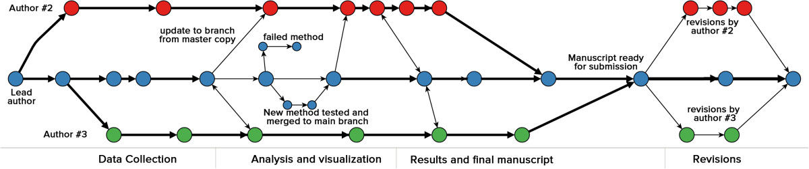

## Key points

1. Learn about difference in synchronous and asynchronous collaboration
2. Learn about concept of version control
3. Why open collaboration is beneficial
4. Find handout that mirrors these slides at [bit.ly/utrecht-collab](https://bit.ly/utrecht-collab)

## (a)synchronous

1. synchronous collaboration = parallel work at the same time
2. asynchronous collaboration = working iteratively
3. science mostly asynchronous, main focus of today
4. Examples of synchronous tools are [Google Docs](https://docs.google.com), [Etherpad](http://etherpad.org/), [Authorea](https://authorea.com).

## Asynchronous

1. You do work, I do work, but we rarely do work together at the same time.
2. Cyclic collaboration, natural to the revision type of work scholars do.
3. However, means we do not see what others do as they do it!
4. In order to understand what others do:
  * include metadata
  * make it easy to parse the project

## Asynchronous

Do these files contain metadata and is it easy to see which one is most recent?

- manuscript.docx
- manuscript_v2.docx
- manuscript_v3.docx
- manuscript_v4_FINAL.docx
- manuscript_v4_FINAL_FINAL.docx
- manuscript_v4_FINAL_FINAL STOP THIS REVISION.docx
- manuscript_v4_FINAL_FINAL STOP THIS REVISION (conflict).docx

## Version control

Version control to the rescue!

1. Metadata about all changes
2. History of individual files tracked
3. Easier to retrace steps

## Version control

```{r, echo=FALSE}
#http://wac-cdn.atlassian.com/dam/jcr:389059a7-214c-46a3-bc52-7781b4730301/hero.svg?cdnVersion=fp
knitr::include_graphics('figures/hero.svg')
```

## Version control

```{r, echo=FALSE}
#http://media.springernature.com/full/springer-static/image/art%3A10.1186%2F1751-0473-8-7/MediaObjects/13029_2013_Article_88_Fig3_HTML.jpg

```

## Version control

1. BUT, version control works best with plain text files (e.g., .csv, .txt), not binary files (e.g., .docx, .pdf).
2. There is a correlation here: binaries more often closed source, plain text more often open standard!
3. Hence, open benefits you as user because it allows for version control.

## Version control example using [Github](https://github.com)

```{r, echo=FALSE}

```

## Version control example using [Github](https://github.com)

```{r, echo=FALSE}

```

## Other version control platforms

1. [Open Science Framework](https://osf.io)
2. [Bitbucket](https://bitbucket.org)
3. [Gitlab](https://gitlab.org)

## Pull requests

```{r, echo=FALSE}
# http://wac-cdn.atlassian.com/dam/jcr:389059a7-214c-46a3-bc52-7781b4730301/hero.svg?cdnVersion=fp
knitr::include_graphics('figures/hero.svg')
```

## Pull requests

1. Massive benefit of version control!
2. However, requires collaborators to be on the same page (rarely the case with profs :-()
3. Can review all changes, discuss, and request updates. Ideal for supervision!

## Example: pull request

```{r, echo=FALSE}

```

## Open collaboration

Fundamentally open collaboration boils down to two things:

1. Create as few barriers as possible (remember: $10 is not much for us, but in certain countries it is!)
2. Allow anyone to contribute to your project
3. Make as much as possible explicit

## Benefits

|Practical aspects to promote open | Your own benefits|
|--------------------------------------------|-----------------------------------------------------------------------------|
| Create as few barriers as possible         | Ensures you will not be locked out of your own research when switching jobs |
| Allow anyone to contribute to your project | Contributions help you improve *your* project                               |
| Make as much as possible explicit          | You have to remember less too!|

## Different?

1. Is collaborating on code and documents fundamentally different?
2. Do we currently collaborate differently for code and documents?

## The same

1. Technically, we can work on both code and documents in the same way
2. As such, version control principle carries over
3. Code = plain text. Allows for version control.
4. Major hurdle: How to create documents in plain text?
5. Later today: how to include code *inside* a document and run it

## Open documents

1. Easiest way to create open documents is Markdown
2. Also created these slides in Markdown
3. You can [learn it in five minutes!](https://daringfireball.net/projects/markdown/syntax)
4. Can even use this in synchronous collaboration if we want to.

## Recap

1. Open isn't zero sum, benefits you as user as well!
2. Open makes you more organized
3. Open forces you to be explicit, also towards yourself (this is amazing when you revisit projects)
4. version control allows you to organize files in time instead of within one folder/

## Exercise [20 minutes approximately]

Version control might be intimidating to get started with. People talk about programmers using Github, which doesn't make it sound any easier. Don't fret! You can get started in a short twenty minutes. Understanding the concep behind version control already goes a long way. 

Let's get you started on using Github.

1. Go to github.com and create an account if you don't already have one.
2. Go to [this](https://guides.github.com/activities/hello-world/) ([https://guides.github.com/activities/hello-world/]()) guide and follow the steps on
  * creating a repository (i.e., project)
  * creating a branch
  * committing information
  * opening a pull request
  * merging a pull request
3. Reflect on how using version control would help you in your own research.