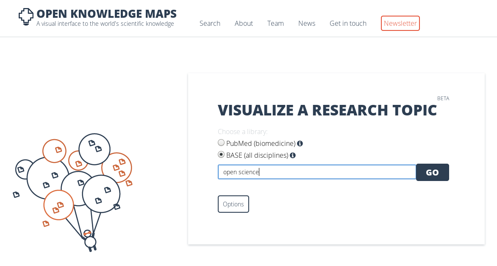
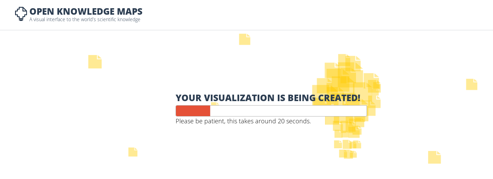
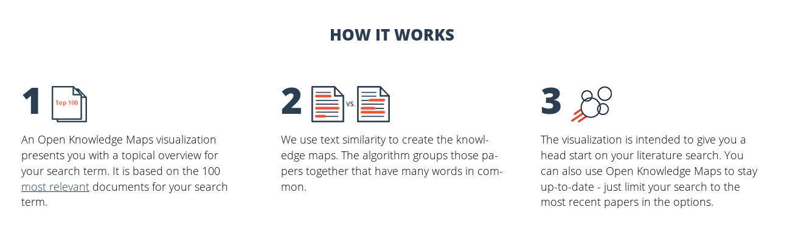
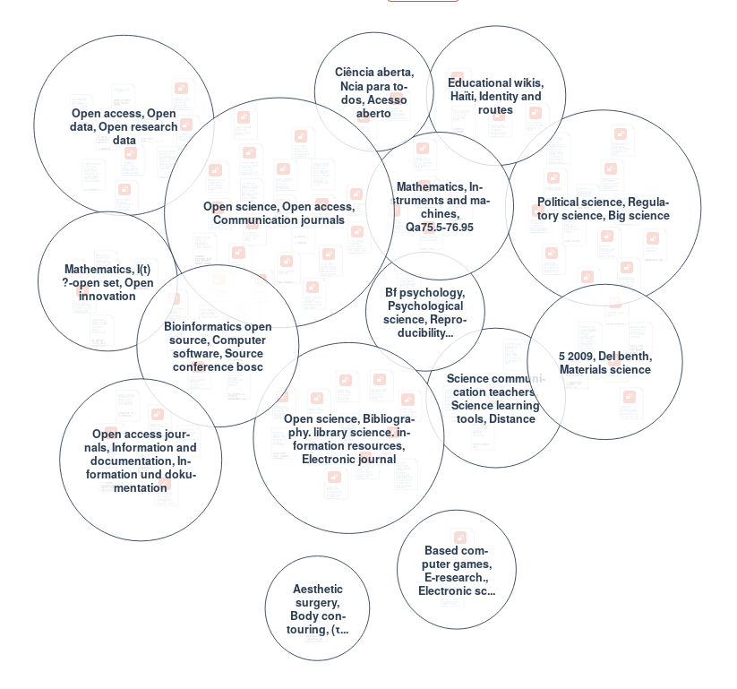
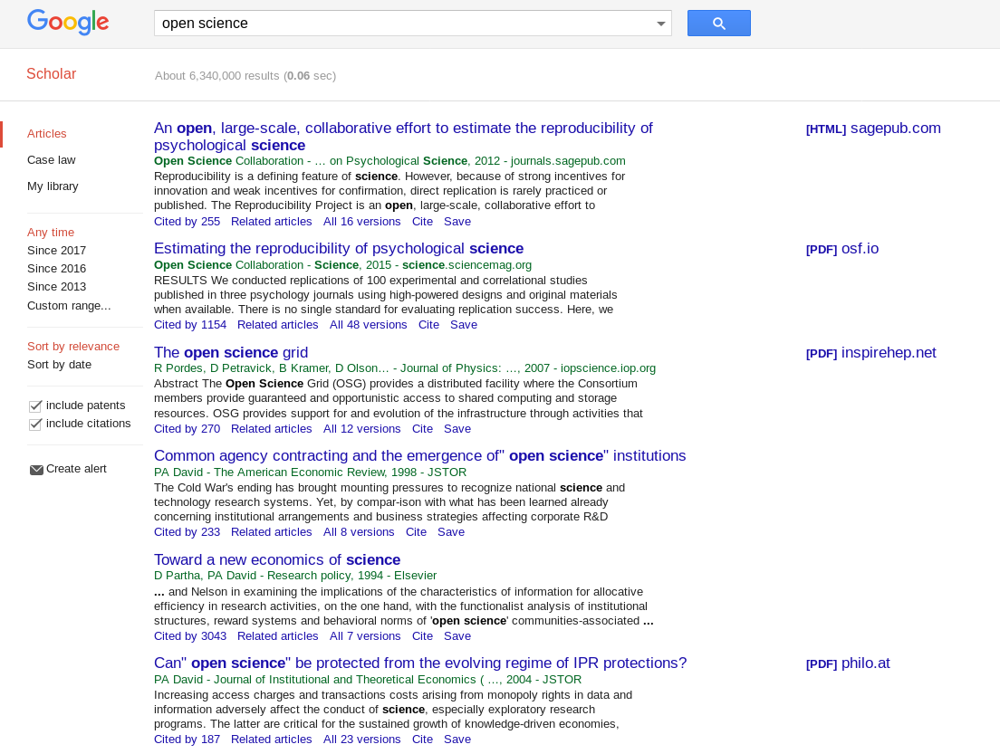
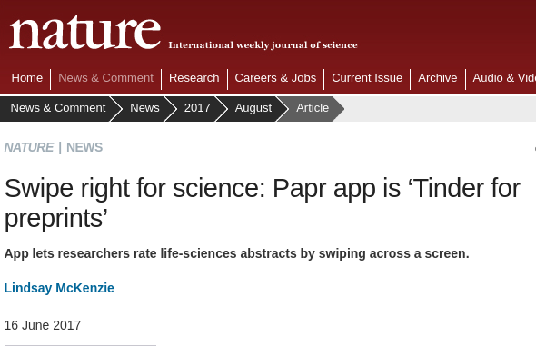
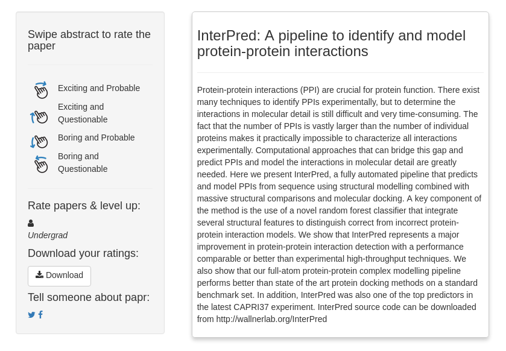
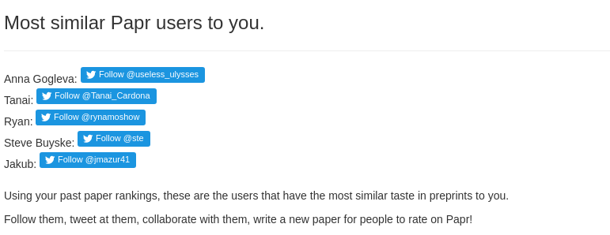

```{r, echo = FALSE}
# Libraries
library(ggplot2)

# Collect crossref data on publications p/year
if(!file.exists('supporting/hitslist'))
{
  hitslist <- NULL
  j <- 1
  for(i in 1950:2017)
  {
    year <- httr::GET(sprintf("http://api.crossref.org/works?filter=from-pub-date:%s,until-pub-date:%s,type:journal-article&rows=0", i, i))
    year_txt <- httr::content(year, "text", encoding = "UTF-8")
    hits <- rjson::fromJSON(year_txt)
    
    hitslist[j] <- hits$message$`total-results`
    
    j <- j + 1
  }
  
  df <- data.frame(year = 1950:2017, hits = hitslist)
  save(df, file = 'supporting/hitslist')
}

load('supporting/hitslist')
```

## Key points

1. Learn about the increased importance of innovation in information discovery
2. Learn about barriers to innovation
3. Learn about an innovative information discovery tool

## But much more information available than to cover in 20 minutes!

## Importance of discovery

1. Discovery is proportional to production of information
2. Digital age allows for many ways to discover/consume information
  * No longer limited by physical restrictions of paper :-)

## Discovery and production

```{r, echo = FALSE}
ggplot(df, aes(x = year, y = hits)) + geom_line()
```

## Importance of discovery

1. Production exploded!
2. Has discovery changed much in last decades?
  * digitization of databases
  * speed of discovery has changed
  * Has mode of discovery changed?

## Production changes

1. Previously, discovery primarily related to scholarly reports
2. Now, more and more data discovery!
  * Due to easier options to share
  * Due to increased data production
  * Due to efficiency in research process
  
## [DataCite](https://datacite.org)

1. [DataCite](https://datacite.org) is the [CrossRef](https://crossref.org) of data
2. Aggregates metadata about data sets from ICPSR, DANS, and other trusted repositories
  * See also [re3data.org](https://re3data.org) for finding trusted repositories to post data to
  
## Data production

```{r, echo = FALSE}
datacite <- httr::GET('https://api.datacite.org/works?rows=0')
metadatacite <- rjson::fromJSON(httr::content(datacite, "text", encoding = "UTF-8"))

tmp <- unique(unlist(metadatacite$meta$years))

years <- tmp[seq(1, length(tmp), 2)]
hits <- tmp[seq(0, length(tmp), 2)]

df_data <- data.frame(year = as.numeric(years), hits = as.numeric(hits))
ggplot(df_data, aes(x = year, y = hits)) + geom_line()
```

## Data discovery

1. Data can be discovered reactively when reading a paper
2. Or by central searches for relevant data
3. What is more common?
4. How much data that is in papers can be found with central searches?

## Combining data and reports

```{r, echo = FALSE}
df_data$type <- "DataCite"
df$type <- "CrossRef"
df_comb <- rbind(df_data, df)

ggplot(df_comb, aes(x = year, y = hits, colour = type)) + geom_line()
```

## Barriers to improved discovery

1. Innovation requires diversity
  - Diversity of innovators
  - Diversity of content
  - Diversity of business models
  - Diversity of ...?
2. As such, for maximum innovation in information discovery, content needs to be available
3. For metadata, already possible with CrossRef, DataCite.
4. For more in-depth discovery (beyond abstract), copyrighted material limits innovation

## Innovations in information discovery

1. Open Access content gives us a glimpse into the potential for innovation
2. Because content is still limited, innovation is only in early stages
  * Predict that we'll see more innovation as more content becomes reusable also for commercial purposes
3. Some examples already present

## Example: [OpenKnowledge Maps](https://openknowledgemaps.org/)

```{r, echo = FALSE}

```

## Example: [OpenKnowledge Maps](https://openknowledgemaps.org/)

```{r, echo = FALSE}

```

## Example: [OpenKnowledge Maps](https://openknowledgemaps.org/)

```{r, echo = FALSE}

```

## Example: [OpenKnowledge Maps](https://openknowledgemaps.org/)

```{r, echo = FALSE}

```

## Example: [OpenKnowledge Maps](https://openknowledgemaps.org/)

```{r, echo = FALSE}

```

## Example: [papr](https://jhubiostatistics.shinyapps.io/papr)

```{r, echo = FALSE}

```

## Example: [papr](https://jhubiostatistics.shinyapps.io/papr)

```{r, echo = FALSE}

```

## Example: [papr](https://jhubiostatistics.shinyapps.io/papr)

```{r, echo = FALSE}

```

## Exercise: information discovery

1. Determine a topic you want to do some literature search on.
2. Conduct a literature search in a database of your choice (Utrecht University has access to Scopus)
3. Conduct the same literature search in [OpenKnowledge Maps](https://openknowledgemaps.org/)
4. What is the added value of each search?
5. Do you think the searches are alternatives or complements in discovery of information? 
6. In a utopia, how would you like to be able to discover information? Get funky with ideas, nothing's too crazy!