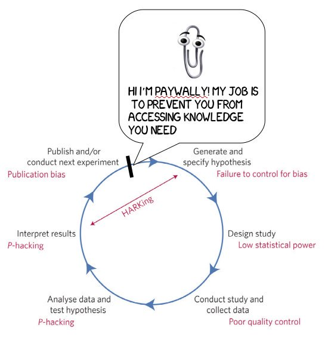

## Key points

1. Learn what reproducibility is
2. State of reproducibility in various fields
3. Understand some of the origins of lack of reproducibility
4. Understand how transparency helps prevent lack of reproducibility and increase accuracy
5. Learn about some ways to improve reproducibility
6. Find handout that mirrors these slides at [bit.ly/utrecht-repro](https://bit.ly/utrecht-repro)

## Reproducibility

1. Reproducibility of results, given data
2. Reproducibility of results, given methods
3. Most recent talk is about (2), but (1) also important (Open Data)

## Reproducibility?

1. How do we define reproducibility of results, given data?
2. How do we define reproducibility of results, given methods?

## Reproducibility given data

1. Reproducibility given data is dependent on:
  * Knowing the exact data used
  * Knowing the exact procedure to clean the data
  * Knowing the exact criteria for the analyses
2. Lack of reproducibility result of
  * Lack of data preservation
  * Manual and/or undocumented data cleaning
  * Click-and-point analysis procedures without syntax
  * Closed source software with variable algorithms

## Improving reproducibility given data

1. Dynamic documents
  * RMarkdown
  * Jupyter notebooks
2. Contained analysis environments
  * ReproZip
  * Docker

## Reproducibility given methods

1. 36% in psychology
2. 11% in cancer medicine
3. 61% in economics

## Causes of irreproducible results

```{r, echo = FALSE}
#http://pbs.twimg.com/media/DBzjjixXoAE4qLy.jpg:large

```

## Improving reproducibility given methods

1. Stop thinking in dichotomous outcomes (one study _will_ not yield the answer)
2. Publish all scientifically valid studies to eliminate publication bias
3. Publish Open Access? [discussion]
4. ...?

## Exercise 1 - reproducing the reproducibility project [prerequisites: R]

1. Go and find the paper from the Reproducibility Project: Psychology [here](http://science.sciencemag.org/content/349/6251/aac4716/tab-pdf) ([http://science.sciencemag.org/content/349/6251/aac4716/tab-pdf]()).
2. Read through the paper and find a result or figure you'd like to reproduce.
3. Find all code underlying the paper on [Github](https://github.com/centerforopenscience/rpp) ([https://github.com/centerforopenscience/rpp]())
4. Try to reproduce the result/figure you chose.
5. Were you succesful? What troubles did you run into?
6. What problems can you imagine running into if trying to make your own research more reproducible?

## Exercise 2 - getting started with Rmarkdown

1. Open Rstudio
2. Create a new Rmarkdown file
3. Try to knit (i.e., generate) the document
4. If succesful, try adjusting part of the code to see how it affects the document.
5. How would dynamic documents help you in your work?
6. If you're enthousiastic about this, there's a longer and more extensive tutorial available [in PDF](https://libscie.github.io/rmarkdown-workshop/handout.pdf) ([https://libscie.github.io/rmarkdown-workshop/handout.pdf]()) or [HTML](https://libscie.github.io/rmarkdown-workshop/handout.html) ([https://libscie.github.io/rmarkdown-workshop/handout.html]())